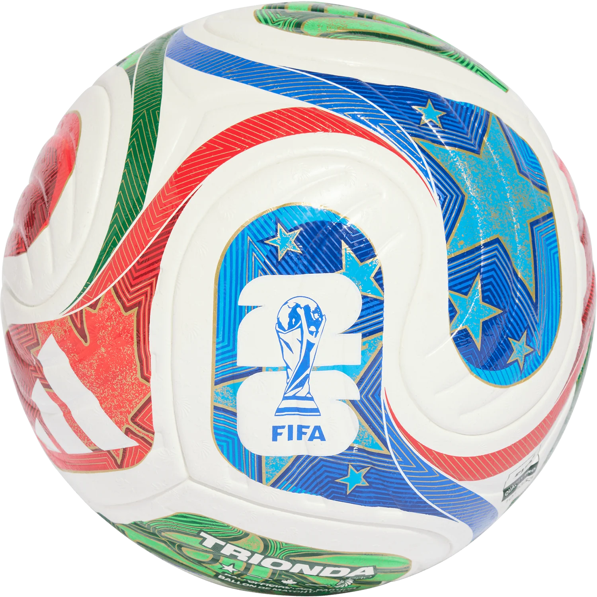

# Documentación para hacer la Quiniela Pública en el Futuro (Multigrupo)

Este archivo contiene el código y la lógica que eliminamos temporalmente para simplificar la aplicación a una sola quiniela privada (Grupo "Chavules"). Cuando decidas hacer la web pública para que cualquiera pueda crearse sus propios grupos, sigue estas instrucciones.

## 1. Estructura HTML de la Landing Page
El contenedor `#landing-container` en `index.html` permite al usuario ingresar el nombre de su grupo y añadir amigos de forma dinámica.

```html
    <!-- Pantalla de Bienvenida / Landing de Creación (Multigrupo) -->
    <div id="landing-container" class="landing-overlay" style="display: none;">
        <div class="landing-card glass-card animate-fade-in">
            <div class="landing-header">
                
                <h2>Crea tu Quiniela Mundial 2026</h2>
                <p>Juega con tus amigos y demuestra quién sabe más de fútbol. ¡Totalmente gratis y sin registros!</p>
            </div>
            
            <div class="landing-body">
                <form id="form-create-group">
                    <div class="form-group">
                        <label for="group-input-name">Nombre de tu Grupo:</label>
                        <input type="text" id="group-input-name" class="form-input" placeholder="Ej. Los Amigos del Trabajo" required maxlength="30">
                    </div>
                    
                    <div class="form-group">
                        <label>Participantes (Amigos):</label>
                        <div id="participants-inputs-container">
                            <div class="participant-input-row">
                                <input type="text" class="form-input participant-name-input" placeholder="Nombre Amigo 1" required maxlength="15">
                                <span class="input-row-index">#1</span>
                            </div>
                            <div class="participant-input-row">
                                <input type="text" class="form-input participant-name-input" placeholder="Nombre Amigo 2" required maxlength="15">
                                <span class="input-row-index">#2</span>
                            </div>
                        </div>
                        <button type="button" id="btn-add-participant" class="btn btn-secondary btn-sm" style="margin-top: 10px;">
                            <span>➕ Añadir Amigo</span>
                        </button>
                    </div>
                    
                    <div class="landing-footer">
                        <button type="submit" class="btn btn-primary btn-block">🚀 Crear Quiniela Privada</button>
                    </div>
                </form>
            </div>
        </div>
    </div>
```

---

## 2. Eventos de la Landing en Javascript (`js/events.js`)
La función `setupLandingEvents()` que maneja la adición dinámica de filas de entrada de amigos y el envío del formulario para crear el grupo en Firebase:

```javascript
export function setupLandingEvents() {
    const btnAdd = document.getElementById('btn-add-participant');
    const container = document.getElementById('participants-inputs-container');
    const formCreate = document.getElementById('form-create-group');

    if (btnAdd && container) {
        btnAdd.addEventListener('click', () => {
            const rowCount = container.querySelectorAll('.participant-input-row').length;
            if (rowCount >= 12) {
                alert("Máximo 12 participantes por grupo.");
                return;
            }
            const row = document.createElement('div');
            row.className = 'participant-input-row';
            row.innerHTML = `
                <input type="text" class="form-input participant-name-input" placeholder="Nombre Amigo ${rowCount + 1}" required maxlength="15">
                <span class="input-row-index">#${rowCount + 1}</span>
                <button type="button" class="btn-remove-row" style="background: none; border: none; color: #ff8787; cursor: pointer; padding: 4px; font-weight: bold;">✕</button>
            `;
            
            row.querySelector('.btn-remove-row').addEventListener('click', () => {
                row.remove();
                // Reindexar números
                container.querySelectorAll('.participant-input-row').forEach((r, idx) => {
                    r.querySelector('.input-row-index').textContent = `#${idx + 1}`;
                    r.querySelector('.participant-name-input').placeholder = `Nombre Amigo ${idx + 1}`;
                });
            });

            container.appendChild(row);
        });
    }

    if (formCreate) {
        formCreate.addEventListener('submit', async (e) => {
            e.preventDefault();
            const groupName = document.getElementById('group-input-name').value.trim();
            const inputElements = container.querySelectorAll('.participant-name-input');
            
            const profiles = [];
            inputElements.forEach((input, index) => {
                const name = input.value.trim();
                if (name) {
                    profiles.push({
                        id: index,
                        name: name,
                        predictions: {}
                    });
                }
            });

            if (profiles.length < 2) {
                alert("Debes añadir al menos 2 participantes.");
                return;
            }

            // Generar una clave de grupo única y corta (6 caracteres aleatorios legibles)
            const chars = 'abcdefghijklmnopqrstuvwxyz0123456789';
            let gId = '';
            for (let i = 0; i < 6; i++) {
                gId += chars.charAt(Math.floor(Math.random() * chars.length));
            }

            // Guardar en la base de datos de Firebase
            const db = window.firebase.database();
            const groupRef = db.ref(`groups/${gId}`);
            
            try {
                await groupRef.set({
                    name: groupName,
                    profiles: profiles
                });
                
                // Redirigir al nuevo grupo
                window.location.search = `?group=${gId}`;
            } catch (err) {
                console.error("Error al crear el grupo:", err);
                alert("Hubo un error al crear la quiniela. Inténtalo de nuevo.");
            }
        });
    }
}
```

---

## 3. Lógica de Inicialización Multigrupo (`app.js`)
El código que procesa la inicialización de la app buscando el parámetro `?group=XYZ` en la URL y gestionando las migraciones automáticas:

```javascript
async function initApp() {
    try {
        const cached = localStorage.getItem('wc2026_api_matches');
        if (cached) state.apiMatchesList = JSON.parse(cached);
    } catch (e) {
        console.error("Error al cargar caché de partidos:", e);
    }

    const urlParams = new URLSearchParams(window.location.search);
    // Control del Rol de Administrador
    if (urlParams.has('admin') || urlParams.get('role') === 'admin') {
        state.userRole = 'admin';
        localStorage.setItem('wc2026_role', 'admin');
    } else if (urlParams.get('admin') === 'false' || urlParams.get('role') === 'user') {
        state.userRole = 'user';
        localStorage.setItem('wc2026_role', 'user');
    } else {
        state.userRole = localStorage.getItem('wc2026_role') || 'user';
    }

    const groupId = urlParams.get('group');
    const landingContainer = document.getElementById('landing-container');
    const appContainer = document.querySelector('.app-container');

    if (!groupId) {
        // Redirección del usuario antiguo al grupo por defecto
        const oldActiveProfile = localStorage.getItem('wc2026_active_profile');
        if (oldActiveProfile !== null) {
            localStorage.setItem('wc2026_active_profile_chavules', oldActiveProfile);
            // ... resto de claves locales
            window.location.search = '?group=chavules';
            return;
        }

        // Si no hay parámetro, mostrar el formulario de creación de grupo
        if (landingContainer) landingContainer.style.display = 'flex';
        if (appContainer) appContainer.style.display = 'none';
        setupLandingEvents();
        return;
    }

    if (landingContainer) landingContainer.style.display = 'none';
    if (appContainer) appContainer.style.display = 'block';

    state.groupId = groupId;
    
    // Cargar perfil reclamado localmente
    const savedMyProfile = localStorage.getItem(`wc2026_my_profile_id_${state.groupId}`);
    state.myProfileId = savedMyProfile !== null ? parseInt(savedMyProfile) : null;

    // Escuchas a la Base de Datos...
    // (Asegurar que mundial_global y groups/${state.groupId} se sincronizan con state)
}
```
